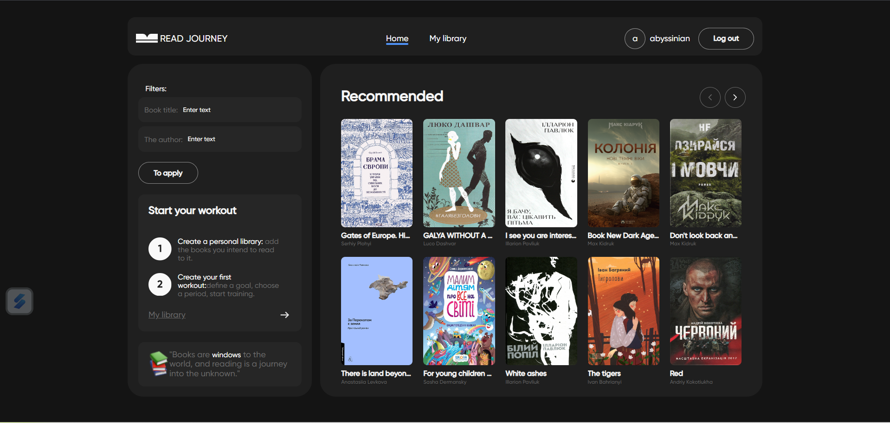
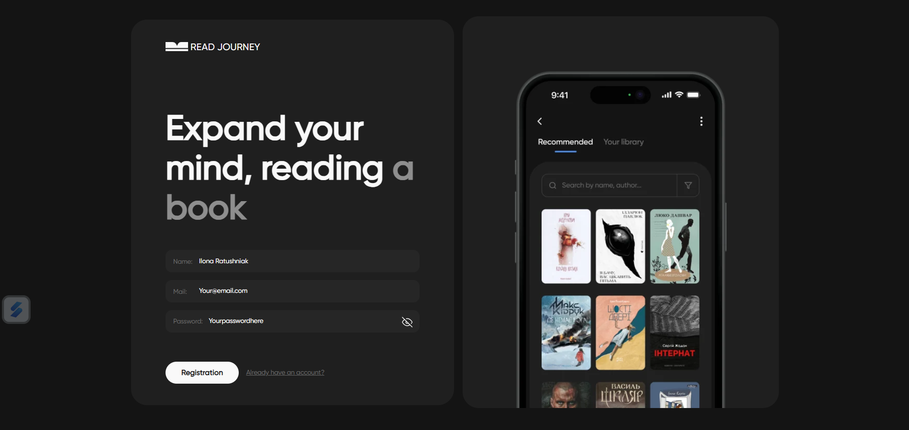

# About project

<section>
<h1> Read journey</h1>

Adaptation to different devices: mobil, tablet ,desktop

User registration and login: created page Login and Register

Workspace for authorized users: Implemented the main layout of the page for authorized users, which includes a header, navigation menu, block with user information and a logout button. The menu is adapted for mobile devices

Recommendation Page: A book recommendation page that includes filters for book searches, an app description block, and a list of recommended books. On this page, the user can add a book to his library.

Adding books: It is possible to select books and add them to the user's library using a modal window

When the user logs out, the data is cleared and the user is redirected to the public welcome page

MyLibraryBooks: This component contains a page header, a selector for filtering books by reading status, and a list of the user's books in the form of a card list. Each card represents a book with a cover image, title, and author. Clicking on the book cover opens a modal window with detailed information about the book and the "Start reading" button, which allows the user to start reading the book.

</section>

# Dependencies

<section>
<h2>Dependencies</h2>
<ul>
<li>@redux-devtools/extension": "^3.3.0</li>
<li>  @reduxjs/toolkit: ^2.2.1</li>
<li>  axios: ^1.6.7</li>
<li>formik: ^2.4.5</li>
<li>modern-normalize: ^2.0.0</li>
<li>prop-types: ^15.8.1</li>
<li>react: ^18.2.0</li>
<li> react-circular-progressbar: ^2.1.0</li>
<li>react-dom: ^18.2.0</li>
<li>react-loader-spinner: ^6.1.6</li>
<li> react-redux: ^9.1.0</li>
<li> react-router-dom: ^6.22.1</li>
<li> react-select: ^5.8.0</li>
<li>react-toastify: ^10.0.5</li>
<li> redux: ^5.0.1</li>
<li> redux-persist: ^6.0.0</li>
<li>styled-components: ^6.1.8</li>
<li> vanta: ^0.5.24</li>
<li>yup: ^1.3.3</li>
</ul>
</section>

# Visual inspection

<section>

</section>
